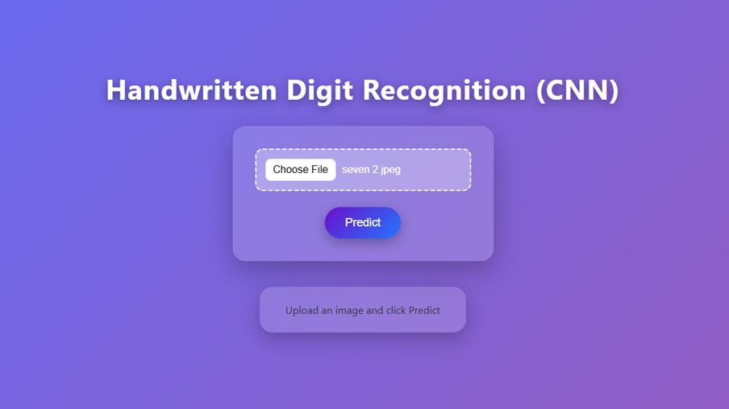
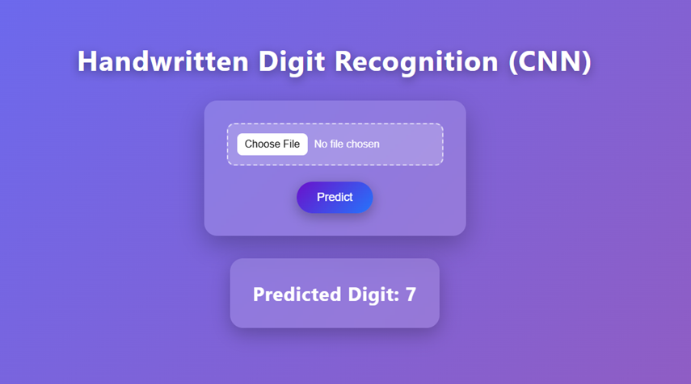

# Handwritten Digit Recognition using CNN

## Project Description
This project is a **Handwritten Digit Recognition System** developed using a **Convolutional Neural Network (CNN)** trained on the **MNIST dataset**.  
The system allows users to upload an image of a handwritten digit through a web interface and predicts the digit in real time using a trained deep learning model.

The project combines:
- Deep Learning (CNN)
- Image Processing
- Flask Web Development
- Frontend Design using HTML & CSS

The final deployed model was trained for **10 epochs**, achieving:
- **99.08% accuracy on MNIST test data**
- **~80–82% accuracy on real-world handwritten digit samples**

---

# Technology Stack and Tools Used

## Programming Language
- Python 3.10

## Deep Learning Framework
- TensorFlow
- Keras

## Backend Framework
- Flask
- Flask-CORS

## Frontend Technologies
- HTML5
- CSS3

## Image Processing
- Pillow (PIL)

## Numerical Computing
- NumPy

## Dataset
- MNIST Handwritten Digit Dataset

## Development Tools
- Visual Studio Code (VS Code)
- Google Collab

---

# Features and Functionalities Implemented

- Upload handwritten digit image through web interface
- CNN-based digit prediction
- Real-time inference using Flask backend
- Image preprocessing pipeline:
  - Grayscale conversion
  - Image resizing (28×28)
  - Color inversion
  - Pixel normalization
  - Reshaping for CNN input
- Responsive frontend interface
- Prediction result display
- Multiple epoch testing and evaluation
- Model performance comparison

---

# CNN Model Architecture

The CNN model contains:
1. Conv2D Layer (32 filters, ReLU)
2. MaxPooling Layer
3. Dropout Layer
4. Conv2D Layer (64 filters, ReLU)
5. MaxPooling Layer
6. Dropout Layer
7. Flatten Layer
8. Dense Layer (128 neurons, ReLU)
9. Dropout Layer
10. Output Dense Layer (10 neurons, Softmax)

---

# Model Performance

## Epoch Testing Results
- 8 Epochs → Underfitting
- 10 Epochs → Best performance (Selected Model)
- 11 Epochs → Slight instability
- 12 Epochs → Reduced real-world accuracy
- 15 Epochs → Overfitting

## Final Selected Model
- Test Accuracy: **99.08%**
- Test Loss: **0.028**
- Real-world Accuracy: **~80–82%**

---

# Project Structure

```bash
Handwritten-Digit-Recognition/
│
├── (.ipynb)file/
│   ├── CNN_(8,10,11,12 epochs).ipynb
│   └── CNN_highepochs_(15epochs).ipynb
│
├── screenshots/
│   ├── homepage.png
│   ├── result.png
│   └── upload_image.png
│
├── static/
│   └── style.css
│
├── templates/
│   └── index.html
│
├── 8epochs.h5
├── 10epochs.h5
├── 11epochs.h5
├── 15epochs.h5
├── digit_model.h5
│
├── app.py
├── README.md
└── requirements.txt
```
---
## Installation and Execution Steps

### Step 1: Clone the Repository

```bash
https://github.com/Mayureshkhedkar/Handwritten-Digit-Recognition-System.git
```

---

### Step 2: Navigate to the Project Directory

```bash
cd handwritten-digit-recognition
```

---

### Step 3: Install Required Libraries

```bash
pip install flask flask-cors tensorflow pillow numpy
```

---

### Step 4: Ensure Model File Exists

Place the trained model file:

```bash
10epochs.h5
```

inside the project root directory.

---

### Step 5: Run the Flask Application

```bash
python app.py
```

---

### Step 6: Open the Application in Browser

Open your browser and navigate to:

```bash
http://127.0.0.1:5000
```
---
## How the System Works

1. User uploads a handwritten digit image through the web interface.
2. Flask backend receives the uploaded image.
3. Image preprocessing is applied:
   - Convert image to grayscale
   - Resize image to 28×28 pixels
   - Invert image colors
   - Normalize pixel values
4. The processed image is passed to the trained CNN model.
5. The CNN model predicts the handwritten digit.
6. The prediction result is displayed on the webpage.

---

## Screenshots / Output

### Home Page
- Upload image interface
- Predict button
- Responsive UI design

### Prediction Output
- Displays predicted digit
- Dynamic result rendering using Flask and Jinja2

Added screenshots inside the `screenshots/` folder.

Example:

```md





```

---

## Future Improvements

- Real-time drawing canvas input
- Mobile application integration
- Multi-digit recognition
- Cloud deployment
- Prediction history logging
- Improved preprocessing techniques
- Advanced CNN architectures

---

## Team Members

### Developer
**Mayuresh Khedkar**  
EN23CS301608

### Guided By
- Dr. Garima Silakari Tukra
- Dr. Sheetal Bawane

Department of Computer Science & Engineering  
Medi-Caps University, Indore

---

## Conclusion

This project demonstrates the practical implementation of a CNN-based handwritten digit recognition system using deep learning and Flask deployment. The system successfully integrates model training, preprocessing, backend development, and frontend design into a complete end-to-end machine learning application.

---

## License

This project is developed for academic and educational purposes.
